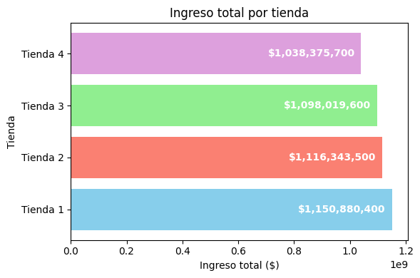
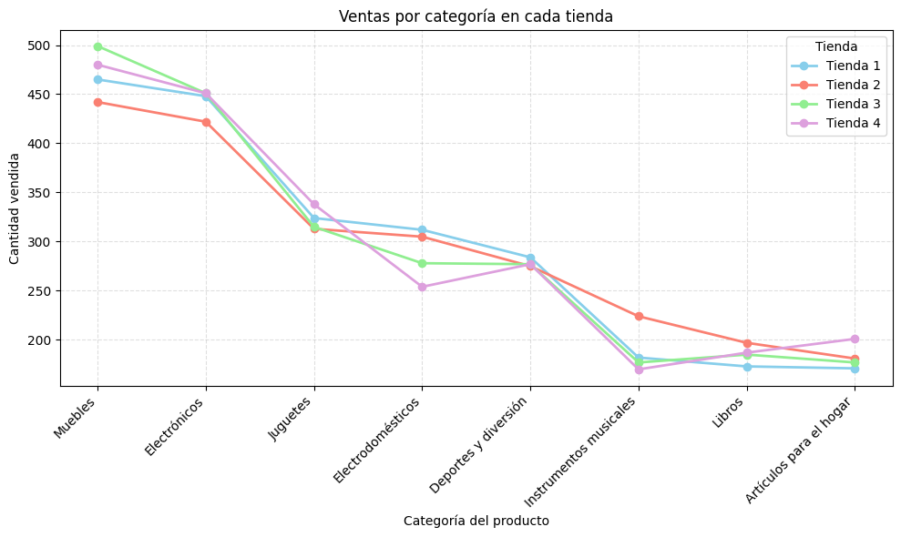
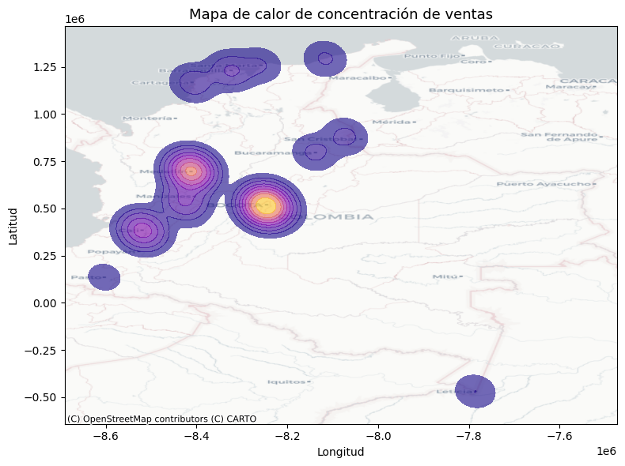

# Challenge Data Science G9 - Aula Latam Oracle

Este proyecto forma parte del desafío de la especialización **Data Science ONE (G9)** de **Oracle Next Education – Alura LATAM**.    
El objetivo fue analizar el desempeño comercial de cuatro tiendas, evaluando ingresos, categorías de productos, calificaciones, costos de envío y desempeño geográfico, para ayudar al Sr. Juan a decidir cuál conviene vender y reinvertir en un nuevo negocio.

## 🔗 Abrir el notebook en Google Colab: 

## 📊 Contenido del análisis
- Ingresos totales por tienda  
- Productos más y menos vendidos  
- Calificaciones promedio  
- Costo de envío promedio  
- Análisis geográfico de ventas  

## 🌎 Visualizaciones destacadas
### Ingreso total por tienda

### Ventas por categoría vs cantidad vendida

### Mapa de calor de concentración de ventas

## 📈 Resultados y Conclusión

- Se recomienda **vender la Tienda 4**, ya que presenta los **menores ingresos**, una **presencia comercial limitada** y **no lidera en ninguna categoría importante**. Además, su **satisfacción del cliente es promedio**, sin ventajas competitivas frente a las demás tiendas.
- Mantener las **Tiendas 1, 2 y 3** permitirá concentrar los recursos en unidades con **mejor rentabilidad y percepción del cliente**, optimizando la inversión futura del Sr. Juan.

## 🧠 Herramientas utilizadas
- Python (Pandas, Matplotlib, Seaborn, GeoPandas, Contextily)
- Google Colab
- GitHub para documentación y versionado

